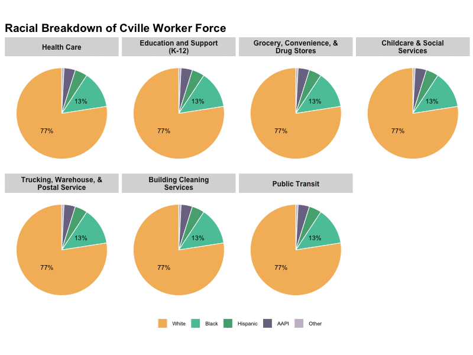

```{r setup, include=FALSE}
knitr::opts_chunk$set(echo = FALSE, message = FALSE, warning = FALSE, error = FALSE)
```

<script>
 <!-- Bootstrap CSS -->
    <link rel="stylesheet" href="https://stackpath.bootstrapcdn.com/bootstrap/4.4.1/css/bootstrap.min.css" integrity="sha384-Vkoo8x4CGsO3+Hhxv8T/Q5PaXtkKtu6ug5TOeNV6gBiFeWPGFN9MuhOf23Q9Ifjh" crossorigin="anonymous">
</script>

```{r cssscript}

writeLines("@import url('https://fonts.googleapis.com/css2?family=Open+Sans&display=swap');
            body {
                font-family: 'Open Sans', sans-serif;
                padding-top: 56px;
            }
                
       #navbartop {
           background-color: rgba(35, 45, 75, .95);
           color: white;
              }",
             con = "mystyle.css")

before_body <- "before_body.html"

 writeLines(
   
'<div class="navbar navbar-dark navbar-fixed-top" id = "navbartop" role="navigation">

    <div class="navbar-header">
   <a class="navbar-brand py-1" href="../../cvilleequity_covid/"  style = "color: white">CVILLE COVID EQUITY</a>
    </div>
    
    <div id="navbar" class="navbar-collapse justify-content-between collapse">
      

    </div><!--/.nav-collapse -->
</div><!--/.navbar -->
', con = before_body)
  


```


```{r, warning=FALSE, message=FALSE}
library(tidyverse)
library(RColorBrewer)
library(cowplot)
library(plotly)

# read in csv
fl <- read.csv("table_from_r.csv")

fl <- fl %>% 
  mutate(Demographic = fct_relevel(Demographic, "Race/Ethnicity")) %>%
  mutate(Level = factor(Level, levels = c("White", "AAPI", "Other", "Hispanic", "Black",
                             "16-24", "25-34", "35-54", "55-64", "65+",
                             "LTHS", "HS", "Some college", "College",
                             "Advanced", "Non-Immigrant", "Immigrant",
                             "Male", "Female", "Insured", "Uninsured")))
```


Prior to the COVID crisis, more than 35,000 workers were employed in the Charlottesville region[^1] in seven broad industries that have been serving on the frontlines of support, sustenance, and care since the pandemic. They make up 29 percent of all workers in our area and include physicians and nurses, grocery store employees and convenience store clerks, warehouse workers and bus drivers, K-12 school teachers and instructional support staff, and cleaning services, among others. They have always been essential, maintaining services and performing work on which we all depend; they have often been underpaid and underappreciated. In the current health crisis, they are too often under protected as well.

As Virginia begins to ease public health restrictions, the frontline workers on which re-opening depends will be placed in increased jeopardy. Given the disproportionalities in the frontline workforce, the increased risk likewise falls even more heavily on people of color. Our region’s essential workers have a right to health and safety protections, paid sick leave, compensation in accord with the hazards they face, and more.

Community-based advocates from the Equity Center Local Steering Committee, working with UVA’s President’s Council on Community-University Partnerships, propose a [Fair Treatment Charter for Frontline Workers](/cvilleequity_covid/frontline/docs/FrontLineWorkers.pdf) outlining a comprehensive set of policies and practices.


# Frontline Workers: Summary

People of color make up 26 percent of frontline workers, compared to 23 percent of the overall workforce; this disproportionality is larger for Black residents, who make up 13 percent of all workers and 18 percent of frontline workers.

<center>

</center>

* While frontline workers as a whole are disproportionately people of color, the differences are particularly stark in two industries: Building Cleaning Services and Public Transit.

* Though men and women make up equal shares of the overall workforce, 68 percent of frontline workers are women.

<center>

</center>

In addition

* While 44 percent of the overall workforce in the region has a college degree, employees in some frontline industries are much less likely to have college degrees --  Grocery, Convenience, and Drug Stores, Trucking, Warehouse, and Postal Service, Building Cleaning Services, and Public Transit.
* Foreign born residents are 28 percent of the workforce in Building Cleaning Services, nearly three times their proportion than in the overall workforce.
* Ten percent of workers in our region lack health insurance. The proportions are notably higher among frontline workers in Building Cleaning Services, and Grocery, Convenience, and Drug Stores, in Trucking, Warehouse, and Postal Service, and in Child Care and Social Services.

# Frontline Workers: Analysis

```{r}
# total number industry
fl <- fl %>% 
  mutate(Job = fct_reorder(Job, total, .desc = TRUE))

tot7 <- fl %>% group_by(Job) %>% slice(1) %>% 
   filter(!(Job %in% c("All Workers", "Total"))) %>% 
  ungroup() %>% select(Job, total) 

pal1 = c("#003f5c", "#2f4b7c", "#665191", "#a05195", "#d45087", "#f95d6a", "#ff7c43", "#ffa600")
pal1r <- colorRampPalette(pal1)


# pal2 <- c("#242582", "#553D67", "#F64C72", "#99738E", "#2F2FA2")
#pal2 <- c("#5D5C61", "#379683", "#7395AE", "#557A95", "#B1A296")
# pal2 <- c("#f4b255", "#d8f0f0", "#3ca36f", "#6a6384", "#c4b8ca")
pal2 <- c("#f4b255", "#41bf9b", "#3ca36f", "#6a6384", "#c4b8ca")

pal2r <- colorRampPalette(pal2)

fl %>% group_by(Job) %>% slice(1) %>% 
  filter(!(Job %in% c("All Workers", "Total"))) %>% 
  ungroup() %>%   
  ggplot(aes(x = Job, y = total)) + geom_col(fill = pal2r(8)) +
  labs(title = "Workers in Frontline Industries", y = "Percent") + 
  annotate("text", x = 1:8, y = tot7$total+750, label = tot7$total, size = 3) +
  annotate("text", x = 8, y = c(15000,13750,12500), label = c("35,154", "Frontline", "Workers")) +
 scale_x_discrete(labels = function(x) str_wrap(x, width = 21)) +
    theme_bw()+
  theme(  axis.title = element_blank(),
        axis.text.x = element_text(angle = 45, hjust = 1),
        legend.position="none", 
        legend.title=element_blank(),
        axis.line =  element_line(color  = "white"),
        strip.background = element_blank(),
        panel.border = element_blank(),
        panel.grid.minor.y = element_blank()
)
        
```

## Overall Characteristics

Understanding who these workers are is necessary for developing and implementing protections. This work is modeled after analysis by the [Center for Economic and Policy Research](https://cepr.net/a-basic-demographic-profile-of-workers-in-frontline-industries/) (see a description of the [methodology below](#methods)). The analysis describes the characteristics of frontline workers in the Charlottesville region, revealing ongoing economic and social inequities between knowledge economy workers, who can work-from-home, and essential workers, who cannot. In particular, frontline workers, who are at a greater risk of being exposed to the virus, are disproportionately people of color, women, and residents without a college degree.

```{r fig.width = 8, fig.height = 6.5}
# number/percent overall by key demographics
demo_comparisons <-
fl %>%  
  filter(Job %in% c("Total Frontline", "All Workers")) %>% 
  filter(Demographic %in% c("Race/Ethnicity", "Age Group", "Education level")) %>%
  group_by(Job, Demographic) %>%
  arrange(Job, Demographic, desc(Level) )%>%
  mutate(height = (cumsum(percent) - percent/2)/100) %>%
  mutate(display = ifelse(percent > 5, paste0(round(percent),"%"), "") )
 
  ggplot(demo_comparisons, aes(x = Job, y = percent, fill = Level)) + 
  geom_bar(position="fill", stat="identity", alpha = .9, colour = "white") +
  geom_text(data = demo_comparisons,
            aes(x = Job, label = display, y = height), color = "Black", alpha = 1, hjust =   .5, size = 3) +
  scale_x_discrete(labels=c("All Workers" = "All", "Total" = "Frontline")) +
  scale_y_continuous(labels = function(x) paste0(round(x*100), "%")) +

  scale_fill_manual(values =c(pal2, pal2, pal2)) +
  labs(title = "Frontline Workers vs. All Workers: Race, Age, Education", 
       y = "Percent") +
  facet_wrap(~Demographic, nrow = 1) + 
  guides(fill = guide_legend(nrow=5)) +
    theme_bw()+

  theme(axis.title = element_blank(), 
        legend.position="bottom", 
        legend.title=element_blank(),
        axis.line =  element_line(color  = "white"),
        strip.background = element_blank(),
        panel.border = element_blank()
)

# WHY 
```

```{r fig.width = 8, fig.height = 5}

more_demo_comps <- fl %>%  
  filter(Job %in% c("Total Frontline", "All Workers")) %>% 
  filter(Demographic %in% c("Foreign born", "Gender", "Health Insurance")) %>% 
  group_by(Job, Demographic) %>%
  arrange(Job, Demographic, desc(Level) )%>%
  mutate(height = (cumsum(percent) - percent/2)/100) %>%
  mutate(display = ifelse(percent > 5, paste0(round(percent),"%"), "") )
  
  ggplot( more_demo_comps, aes(x = fct_rev(Job), y = percent, fill = Level)) + 
  geom_bar(position="fill", stat="identity", alpha = .8, colour = "white") +
  geom_text(data = more_demo_comps,
            aes(x = Job, label = display, y = height), color = "Black", alpha = 1, hjust =   .5, size = 3) +
 
  scale_x_discrete(labels=c("All Workers" = "All", "Total" = "Frontline")) +
  scale_y_continuous(labels = function(x) paste0(round(x*100), "%")) +

  scale_fill_manual(values =c(pal2[c(2,5)], pal2[c(2,5)], pal2[c(2,5)])) +
    labs(title = "Frontline Workers vs. All Workers: Immigrant Status, Gender, Insurance", y = "Percent") +
  facet_wrap(~Demographic, nrow = 1) + 
    guides(fill = guide_legend(nrow=2)) +
  theme_bw()+
  theme(
        axis.title = element_blank(),
        legend.position="bottom", 
        legend.title=element_blank(),
        axis.line =  element_line(color  = "white"),
        strip.background = element_blank(),
        panel.border = element_blank()
)

```
<br>
Key findings:

* People of color make up 26 percent of frontline workers, compared to 23 percent of the overall workforce; this disproportionality is largest for Black residents, who make up 13 percent of all workers and 18 percent of frontline workers.
* The age distribution of frontline workers is similar to that of all workers, though young adults -- those aged 25-34 -- are somewhat overrepresented on the frontlines.
* Though men and women make up equal shares of the overall workforce, 68 percent of frontline workers are women.
* As a group, frontline workers are no more likely to be immigrants or to lack health insurance compared to all workers.

However, several of these differences vary widely across industries.

## Frontline Workers by Industry

The characteristics of frontline workers differ across the included industries -- health care workers and school teachers, in particular, are more likely to have college degrees and health insurance than the overall workforce, while workers in other industries fare much worse. The following analysis provides the same demographic profile as above separately for each of the six included industries.

### Race and Ethnicity

```{r fig.width = 8, fig.height = 5}
fl <- fl %>% 
  mutate(Job = fct_reorder(Job, total))

# race
tot7 <- fl %>% filter(Demographic == "Race/Ethnicity" & Job != "All Workers") %>% 
  select(Job, total) %>% group_by(Job) %>% slice(1)

flind_race <-
fl %>% 
  filter(Demographic == "Race/Ethnicity") %>% 
  group_by(Job, Demographic) %>%
  arrange(Job, Demographic, desc(Level) )%>%
  mutate(height = (cumsum(percent) - percent/2)/100) %>%
  mutate(display = ifelse(percent > 5, paste0(round(percent),"%"), "") )
  
  
  ggplot(flind_race, aes(x = Job, y = percent/100, fill = Level)) +
  geom_bar(position="fill", stat="identity", alpha = .8, colour = "white") +
  geom_text(data = flind_race,
            aes(x = Job, label = display, y = height), color = "Black", alpha = 1, hjust =   .5, size = 3) +
    
     geom_text(data = flind_race %>%
                         group_by(Job) %>%
                 slice(1),
          aes(x = Job, label = paste0("Total:\n", prettyNum(total, big.mark = ",", trim=TRUE)) , y = 1.01), color = "Black", alpha = 1, hjust = 0, size = 3) +
  
  coord_cartesian(clip = 'off') +

  scale_x_discrete(labels = function(x) str_wrap(x, width = 21)) +
  scale_y_continuous(labels = function(x) paste0(round(x*100), "%"),  expand = c(0, 0 ), limits = c(0, 1.08)) +

  coord_flip() + 
  scale_fill_manual(values = pal2,
                    name = element_blank(),
                    guide = guide_legend(reverse = TRUE)) +
  labs(title = "Frontline Industries by Race", y = "Percent") +
  # annotate("text", x = 1:7, y = 110, label = tot7$total, size = 3) +
 theme_bw()+
  theme(
        axis.title = element_blank(),
        legend.position="bottom", 
        legend.title=element_blank(),
        axis.line =  element_line(color  = "white"),
        strip.background = element_blank(),
        panel.border = element_blank()
)

```

While frontline workers as a whole are disproportionately people of color, the differences are particularly stark in two industries: 

* Building Cleaning Services, where 25 percent of the workforce is Hispanic, compared to 4 percent overall, and another 23 percent of the workforce is Black, compared to 13 percent overall.
* Public transit, where a full 61 percent of the workforce is Black, compared to 13 percent overall.

### Age Groups

```{r fig.width = 8, fig.height = 5}
# age
flind_age <-
fl %>% 
  filter(Demographic == "Age Group") %>% 
  group_by(Job, Demographic) %>%
  arrange(Job, Demographic, desc(Level) )%>%
  mutate(height = (cumsum(percent) - percent/2)/100) %>%
  mutate(display = ifelse(percent > 5, paste0(round(percent),"%"), "") )
  
  
ggplot(flind_age, aes(x = Job, y = percent/100, fill = Level)) +
  geom_bar(position="fill", stat="identity", alpha = .8, colour = "white") +
  geom_text(data = flind_age,
            aes(x = Job, label = display, y = height), color = "Black", alpha = 1, hjust =   .5, size = 3) +
  geom_text(data = flind_age %>% group_by(Job) %>% slice(1),
          aes(x = Job, label = paste0("Total:\n", prettyNum(total, big.mark = ",", trim=TRUE)) , y = 1.01), color = "Black", alpha = 1, hjust = 0, size = 3) +
  
  coord_cartesian(clip = 'off') +

  scale_x_discrete(labels = function(x) str_wrap(x, width = 21)) +
  scale_y_continuous(labels = function(x) paste0(round(x*100), "%"),  expand = c(0, 0 ), limits = c(0, 1.08)) +
  scale_fill_manual(values = pal2,
                    name = element_blank(),
                    guide = guide_legend(reverse = TRUE)) +
  coord_flip() + 
  
  labs(title = "Frontline Industries by Age", y = "Percent") +
  # annotate("text", x = 1:7, y = 110, label = tot7$total, size = 3) +
 theme_bw()+
  theme(
        axis.title = element_blank(),
        legend.position="bottom", 
        legend.title=element_blank(),
        axis.line =  element_line(color  = "white"),
        strip.background = element_blank(),
        panel.border = element_blank()
)

```

Looking at the age of workers by industry,

* Our youngest workers, aged 16-24, are overrepresented in frontline retail positions, making up 20 percent of the Grocery, Convenience, and Drug Stores industries compared to their 12 percent of the overall workforce.
* Young adult workers, 25-34, are 22 percent of all workers, but 38 percent of workers in Building Cleaning Services and 28 percent of workers in Health Care.
* Workers aged 55 and over compose 44 percent of workers in Public Transit, and 33 percent of workers in Building Cleaning Services, though they are 25 percent of the overall workforce.

### Educational Attainment

```{r fig.width = 8, fig.height = 5}
# education
flind_educ <- 
fl %>% filter(Demographic == "Education level") %>% 
  mutate(Level = factor(Level, c("Advanced", "College", "Some college", "HS", "LTHS"))) %>% 
  group_by(Job, Demographic) %>%
  arrange(Job, Demographic, desc(Level) )%>%
  mutate(height = (cumsum(percent) - percent/2)/100) %>%
  mutate(display = ifelse(percent > 5, paste0(round(percent),"%"), "") )
  
  
  
ggplot(flind_educ, aes(x = Job, y = percent/100, fill = Level)) +
  geom_bar(position="fill", stat="identity", alpha = .8, colour = "white") +
  geom_text(data = flind_educ,
            aes(x = Job, label = display, y = height), color = "Black", alpha = 1, hjust =   .5, size = 3) +
  geom_text(data = flind_educ %>% group_by(Job) %>% slice(1),
          aes(x = Job, label = paste0("Total:\n", prettyNum(total, big.mark = ",", trim=TRUE)) , y = 1.01), color = "Black", alpha = 1, hjust = 0, size = 3) +
  
  coord_cartesian(clip = 'off') +

  scale_x_discrete(labels = function(x) str_wrap(x, width = 21)) +
  scale_y_continuous(labels = function(x) paste0(round(x*100), "%"),  expand = c(0, 0 ), limits = c(0, 1.08)) +
  scale_fill_manual(values = pal2,
                    name = element_blank(),
                    guide = guide_legend(reverse = TRUE)) +
  coord_flip() + 
  
  labs(title = "Frontline Industries by Education", y = "Percent") +
  # annotate("text", x = 1:7, y = 110, label = tot7$total, size = 3) +
 theme_bw()+
  theme(
        axis.title = element_blank(),
        legend.position="bottom", 
        legend.title=element_blank(),
        axis.line =  element_line(color  = "white"),
        strip.background = element_blank(),
        panel.border = element_blank()
)

```

Within all frontline industries except Health Care and Education, workers are less likely to have a college degree relative to the overall workforce. Some of the differences are especially big. In the overall workforce, 57 percent of workers do not have a college degree, compared to:

* 82 percent of the workers in the Grocery, Convenience, and Drug Stores industries,
* 94 percent of the workers in Trucking, Warehouse, and Postal Service industries, 
* 91 percent of workers in Building Cleaning Services, and
* 93 percent of workers in Public Transit.

### Foreign Born

```{r}
# immigrant status
flind_for <- 
fl %>% filter(Demographic ==  "Foreign born") %>% 
  group_by(Job, Demographic) %>%
  arrange(Job, Demographic, desc(Level) )%>%
  mutate(height = (cumsum(percent) - percent/2)/100) %>%
  mutate(display = ifelse(percent > 5, paste0(round(percent),"%"), "") )


  ggplot(flind_for, aes(x = Job, y = percent/100, fill = Level)) +
  geom_bar(position="fill", stat="identity", alpha = .8, colour = "white") +
  geom_text(data = flind_for,
            aes(x = Job, label = display, y = height), color = "Black", alpha = 1, hjust =   .5, size = 3) +
  geom_text(data = flind_for %>% group_by(Job) %>% slice(1),
          aes(x = Job, label = paste0("Total:\n", prettyNum(total, big.mark = ",", trim=TRUE)) , y = 1.01), color = "Black", alpha = 1, hjust = 0, size = 3) +
  
  coord_cartesian(clip = 'off') +

  scale_x_discrete(labels = function(x) str_wrap(x, width = 21)) +
  scale_y_continuous(labels = function(x) paste0(round(x*100), "%"),  expand = c(0, 0 ), limits = c(0, 1.08)) +

  scale_fill_manual(values = pal2[c(2,4)], 
                    name = element_blank(),
                    guide = guide_legend(reverse = TRUE)) +
    
  coord_flip() +
  labs(title = "Frontline Workers by Immigrant Status", y = "Percent") +
  # annotate("text", x = 1:7, y = 110, label = tot7$total, size = 3) +
 theme_bw()+
  theme(
        axis.title = element_blank(),
        legend.position="bottom", 
        legend.title=element_blank(),
        axis.line =  element_line(color  = "white"),
        strip.background = element_blank(),
        panel.border = element_blank()
)

```

Residents not born in the United States (note, this is not citizenship status, but captures individuals who have immigrated to the US) make up 10 percent of the workforce in our region overall and 8 percent of frontline workers overall. But this obscures a big disparity:

* Foreign born residents are 28 percent of the workforce in Building Cleaning Services, nearly three times their proportion than in the overall workforce.

### Gender

```{r}
# gender
flind_gend <- 
fl %>% filter(Demographic ==  "Gender") %>% 
  group_by(Job, Demographic) %>%
  arrange(Job, Demographic, desc(Level) )%>%
  mutate(height = (cumsum(percent) - percent/2)/100) %>%
  mutate(display = ifelse(percent > 5, paste0(round(percent),"%"), "") )


  ggplot(flind_gend, aes(x = Job, y = percent/100, fill = Level)) +
  geom_bar(position="fill", stat="identity", alpha = .8, colour = "white") +
  geom_text(data = flind_gend,
            aes(x = Job, label = display, y = height), color = "Black", alpha = 1, hjust =   .5, size = 3) +
  geom_text(data = flind_gend %>% group_by(Job) %>% slice(1),
          aes(x = Job, label = paste0("Total:\n", prettyNum(total, big.mark = ",", trim=TRUE)) , y = 1.01), color = "Black", alpha = 1, hjust = 0, size = 3) +
  
  coord_cartesian(clip = 'off') +

  scale_x_discrete(labels = function(x) str_wrap(x, width = 21)) +
  scale_y_continuous(labels = function(x) paste0(round(x*100), "%"),  expand = c(0, 0 ), limits = c(0, 1.08)) +

  scale_fill_manual(values = pal2[c(2,4)], 
                    name = element_blank(),
                    guide = guide_legend(reverse = TRUE)) +
    
  coord_flip() +
  labs(title = "Frontline Workers by Gender", y = "Percent") +
  # annotate("text", x = 1:7, y = 110, label = tot7$total, size = 3) +
 theme_bw()+
  theme(
        axis.title = element_blank(),
        legend.position="bottom", 
        legend.title=element_blank(),
        axis.line =  element_line(color  = "white"),
        strip.background = element_blank(),
        panel.border = element_blank()
)

```

While women compose half of all workers in our region, they are 66 percent of workers in frontline industries. Women are distinctly overrepresented in several industries:

* Women make up 73 percent of workers in Health Care,
* Women make up 90 percent of workers in Child Care and Social Services, and
* Women make up 61 percent of workers in Building Cleaning Services.

### Health Insurance

```{r}
# health insurance
# gender
flind_ins <- 
fl %>% filter(Demographic ==  "Health Insurance") %>% 
  group_by(Job, Demographic) %>%
  arrange(Job, Demographic, desc(Level) )%>%
  mutate(height = (cumsum(percent) - percent/2)/100) %>%
  mutate(display = ifelse(percent > 5, paste0(round(percent),"%"), "") )


  ggplot(flind_ins, aes(x = Job, y = percent/100, fill = Level)) +
  geom_bar(position="fill", stat="identity", alpha = .8, colour = "white") +
  geom_text(data = flind_ins,
            aes(x = Job, label = display, y = height), color = "Black", alpha = 1, hjust =   .5, size = 3) +
  geom_text(data = flind_ins %>% group_by(Job) %>% slice(1),
          aes(x = Job, label = paste0("Total:\n", prettyNum(total, big.mark = ",", trim=TRUE)) , y = 1.01), color = "Black", alpha = 1, hjust = 0, size = 3) +
  
  coord_cartesian(clip = 'off') +

  scale_x_discrete(labels = function(x) str_wrap(x, width = 21)) +
  scale_y_continuous(labels = function(x) paste0(round(x*100), "%"),  expand = c(0, 0 ), limits = c(0, 1.08)) +

  scale_fill_manual(values = pal2[c(2,4)], 
                    name = element_blank(),
                    guide = guide_legend(reverse = TRUE)) +
    
  coord_flip() +
  labs(title = "Frontline Workers by Health Insurance", y = "Percent") +
  # annotate("text", x = 1:7, y = 110, label = tot7$total, size = 3) +
 theme_bw()+
  theme(
        axis.title = element_blank(),
        legend.position="bottom", 
        legend.title=element_blank(),
        axis.line =  element_line(color  = "white"),
        strip.background = element_blank(),
        panel.border = element_blank()
)

```

Among all workers in our region, 90 percent have health insurance and 10 percent are uninsured. The numbers are similar among all frontline workers. Yet several frontline industries have disproportionate numbers of uninsured workers.

* Within Building Cleaning Services, 34 percent of workers lack health insurance.
* About 15 percent of workers in Grocery, Convenience, and Drug Stores, in Trucking, Warehouse, and Postal Service, and in Child Care and Social Services lack health insurance.

# Methodology {#methods}

This local analysis was based on the work of the Center for Economic and Policy Research (CEPR) building from their analysis of [frontline workers at the national and state level](https://cepr.net/a-basic-demographic-profile-of-workers-in-frontline-industries/). The data for this analysis is from the most recent five-year estimates of data from the American Community Survey (2014-2018) [Public Use Microdata Sample0(https://www.census.gov/programs-surveys/acs/data/pums.html). Using only survey data from the respondents in the [Thomas Jefferson Planning District](http://tjpdc.org/)[^2] As the CEPR study notes: "The demographics of the frontline workforce is unlikely to have changed in any substantial way over the last two years, and using five-year estimates of ACS data helps ensure that sample sizes are sufficient to produce reasonably precise estimates by industry."

Using their initial code, we adapted it to generate estimates of frontline workers and their characteristics for our region. The CEPR analysis defined frontline industries using the same definitions as the [New York City Comptroller's report](https://comptroller.nyc.gov/reports/new-york-citys-frontline-workers/#Methodology): direct-service employees in the grocery, pharmacy, transit, delivery & storage, cleaning, healthcare, and social services industries. These include the following industry classifications: 

* Grocery, Convenience, and Drug Stores: Grocery and related product merchant wholesalers, Supermarkets and other grocery stores, Convenience Stores, Pharmacies and drug stores, and General merchandise stores, including warehouse clubs and supercenters.
* Public Transit: Rail transportation and Bus service and urban transit.
* Trucking, Warehouse, and Postal Service: Truck transportation, Warehousing and storage, and Postal Service.
* Building Cleaning Services: Cleaning Services to Buildings and Dwellings.
* Health Care: Offices of physicians, Outpatient care centers, Home health care services, Other health care services, General medical and surgical hospitals, and specialty hospitals, Psychiatric and substance abuse hospitals, Nursing care facilities (skilled nursing facilities), and Residential care facilities, except skilled nursing facilities.
* Child Care and Social Services: Individual and family services, Community food and housing, and emergency services, and Child day care services.

We added to this list 

* Education and Support (K-12): Elementary and secondary schools, Other schools and instruction and educational support services.

The [Bay Area analysis](https://bayareaequityatlas.org/essential-workers) began with the same six industries, and then added in additional industries deemed locally relevant by community leaders, including:

* Construction: Occupations within the construction industry, including construction trades (e.g., electricians, painters) and laborers.
* Select Manufacturing: Food and agricultural manufacturing; medical supply manufacturing; other critical manufacturing (e.g., commercial and service industry machinery).
* Domestic Workers (not including health care): Private households.
* Agriculture, Forestry, and Fishing: Crop production; animal production and aquaculture; forestry except logging; logging; fishing, hunting and trapping; support activities for agriculture and forestry.
* Utilities: Electric power generation, transmission, and distribution; natural gas distribution; electric and gas, and other combinations; water, steam, air conditioning, and irrigation systems; sewage treatment facilities; not specified utilities.

With community expertise and input, we could supplement and revise this analysis further with additional industries.

As both CEPR and the Bay Area analysis observe, this approach includes all workers (16 and above) in the relevant industry but no workers in frontline occupations  outside of these chosen categories. This means the estimates "exclude some workers in occupations (but not industries) that are clearly on the frontlines, while also including some workers who are not in frontline occupations, even though they are in frontline industries." As an example, a police officer is a frontline occupation in a non-frontline industry; a school bus driver is a non-frontline occupation when schools are closed, but in a frontline industry. "Still," CPER notes, "the vast majority of workers in the six frontline industries are frontline workers."

All of the code to produce this report is available on our [GitHub repo](https://github.com/virginiaequitycenter/cvilleequity_covid/tree/master/frontline).

[^1]: The Charlottesville region is defined here as the Thomas Jefferson Area Planning District, which consists of the City of Charlottesville, Albemarle County, Fluvanna County, Green County, Louisa County, and Nelson County. 

[^2]: In the ACS PUMS data, the TJPD area is composed of Public Use Microdata Areas 51089 and 51090.